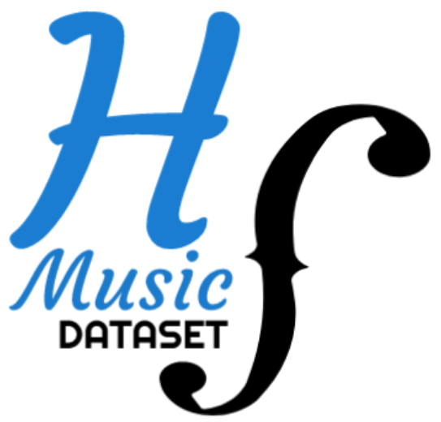

# Huge Symbolic Music Dataset (HSMusic)

* Effort to group most MIDI file as possible and automatically tag them.
* Small library to feed ML models with MIDI files.

Count | 130 943
--- | ---
Data format | MIDI
Tags | Style, composer, title and many more (multilabels)

### How to contribute?

If you want to add MIDI files to HSMusic Dataset, please contact me: [adrien.pavao@gmail.com]()

### Roadmap
* Complete the data collection
* Upload the database on a server
* Add documentation and complete library

##### Library
* to_matrix: convert MIDI file into a binary matrix
* to_midi: convert a binary matrix into a MIDI file
* download_dataset: fetch data and labels from the server
* TODO: read_data, data_augmentation (transposition, rythm, etc.), change_mode

##### Sources
* [freemidis.net](http://freemidis.net/)
* [reddit.com, 'largest midi collection on the internet'](https://www.reddit.com/r/WeAreTheMusicMakers/comments/3ajwe4/the_largest_midi_collection_on_the_internet/)
* [uma.es](https://www.uma.es/victoria/)
* [composing.ai](https://composing.ai/dataset)
* [piano-e-competition](http://www.piano-e-competition.com/)
* [github.com, 'symbolic musical datasets'](https://github.com/wayne391/Symbolic-Musical-Datasets)
* [colinraffel.com](https://colinraffel.com/projects/lmd/)
* [Ben Burgraff's Midi Collection](http://cariart.tripod.com/MIDIS.html)
* [vgmusic.com](https://www.vgmusic.com/)
